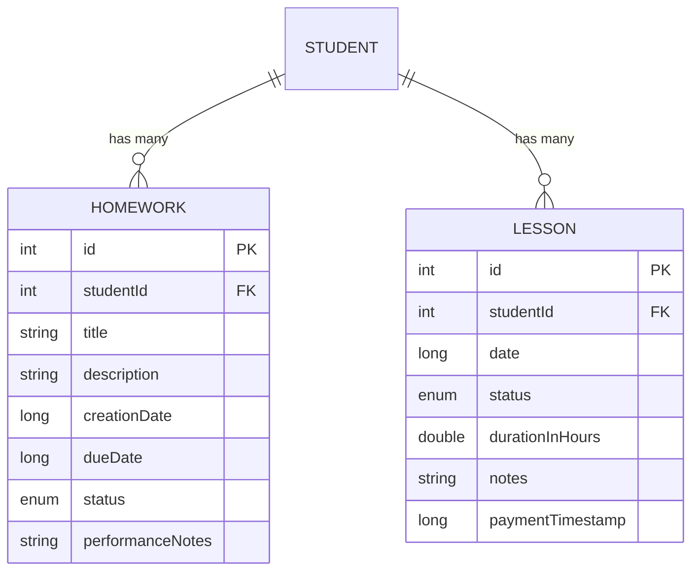
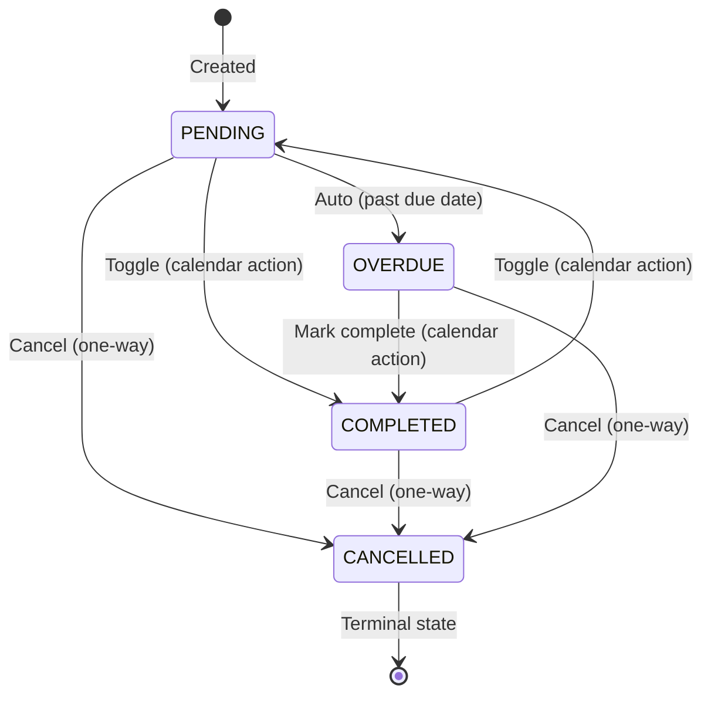
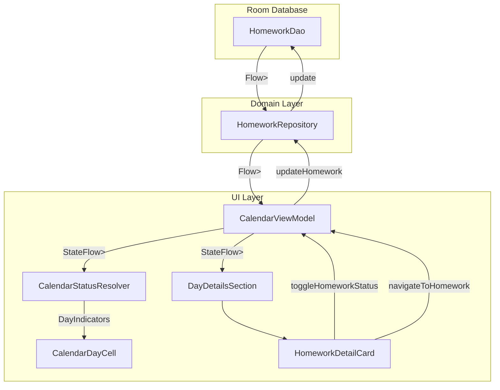

# Data Model: Calendar Homework Integration

**Feature**: Show Homeworks on Calendar
**Date**: 2026-03-05 (updated post-clarification)

## Entities

### Homework

The core domain entity for student assignments.

| Field | Type | Description | Constraints |
|-------|------|-------------|-------------|
| `id` | `Int` | Auto-generated primary key | Unique, non-null |
| `studentId` | `Int` | Foreign key → `Student.id` | Non-null, indexed |
| `title` | `String` | Short name of the homework | Non-null, non-empty |
| `description` | `String` | Detailed instructions | Non-null (may be empty) |
| `creationDate` | `Long` | Epoch millis when homework was created | Non-null |
| `dueDate` | `Long` | Epoch millis for the deadline | Non-null, indexed |
| `status` | `HomeworkStatus` | Current lifecycle state | Non-null, default `PENDING` |
| `performanceNotes` | `String?` | Optional tutor notes on student performance | Nullable |

**Location**: `app/src/main/java/com/barutdev/kora/domain/model/Homework.kt`

### HomeworkStatus

Enum representing the lifecycle states of a homework assignment.

| Value | Description | Color (Calendar) | Color (Card) |
|-------|-------------|-------------------|--------------|
| `PENDING` | Assignment created, not yet completed | Orange (`#FB8C00`) | Orange |
| `COMPLETED` | Student finished the assignment | Teal (`#009688`) | Teal |
| `OVERDUE` | Past due date and not completed | Magenta (`#E91E63`) | Magenta |
| `CANCELLED` | Assignment cancelled by tutor | Gray (`#9E9E9E`) | Gray |

**Location**: `app/src/main/java/com/barutdev/kora/domain/model/HomeworkStatus.kt`

**Current state**: Only 3 values exist (`PENDING`, `COMPLETED`, `OVERDUE`). `CANCELLED` must be added.

### LessonStatus (existing, unchanged)

| Value | Description | Color |
|-------|-------------|-------|
| `PAID` | Lesson completed and paid | Green (`#2E7D32`) |
| `COMPLETED` | Lesson completed, awaiting payment | Yellow (`#F9A825`) |
| `SCHEDULED` | Future lesson | Blue (`#1E88E5`) |
| `CANCELLED` | Lesson cancelled | Red (`#D32F2F`) |

## Relationships



## State Machine: HomeworkStatus



### Transition Rules

| From | To | Trigger | Reversible |
|------|-----|--------|-----------|
| `PENDING` | `COMPLETED` | User toggle via calendar action button | ✅ Yes |
| `COMPLETED` | `PENDING` | User toggle via calendar action button | ✅ Yes |
| `PENDING` | `OVERDUE` | System auto-detect (dueDate < today) | ❌ No (auto only) |
| `OVERDUE` | `COMPLETED` | User marks complete from calendar | ❌ One-way to COMPLETED |
| Any | `CANCELLED` | User cancels from homework screen | ❌ Terminal, one-way |

### Overdue Detection

Overdue is resolved at **render time** in `CalendarStatusResolver`:
- If `homework.status == PENDING` and `dueDate < today`, render as OVERDUE (Magenta)
- The ViewModel may optionally persist the `OVERDUE` transition to the database

## Data Flow



## New Data Structures

### DayIndicators

Return type for the refactored `CalendarStatusResolver`, replacing the single `Color?`.

```kotlin
internal data class DayIndicators(
    val lessonColor: Color? = null,
    val homeworkColor: Color? = null
)
```

**Usage**: `CalendarDayCell` renders:
- Two side-by-side dots when both are non-null
- Single centered dot when only one is non-null
- No dots when both are null

### Color Constants (new additions to Color.kt)

```kotlin
// Homework Status Colors (distinct from lesson colors)
val HomeworkTeal = Color(0xFF009688)           // Completed
val HomeworkTealContainer = Color(0xFFE0F2F1)  // Completed card bg
val HomeworkMagenta = Color(0xFFE91E63)        // Overdue
val HomeworkMagentaContainer = Color(0xFFFCE4EC) // Overdue card bg
val HomeworkGray = Color(0xFF9E9E9E)           // Cancelled
val HomeworkGrayContainer = Color(0xFFF5F5F5)  // Cancelled card bg
// Orange already exists as StatusOrange (#FB8C00) — used for Pending
```

## Database Migration

Adding `CANCELLED` to `HomeworkStatus` enum:
- Room stores enums as strings (`@TypeConverter`). Adding a new enum value is **backwards-compatible** — no schema migration needed.
- Existing data with `PENDING`, `COMPLETED`, `OVERDUE` values will continue to deserialize correctly.
- Verify: Check if `HomeworkEntity` uses `@TypeConverter` or ordinal storage. If ordinal, adding `CANCELLED` at the end preserves existing ordinal values.
