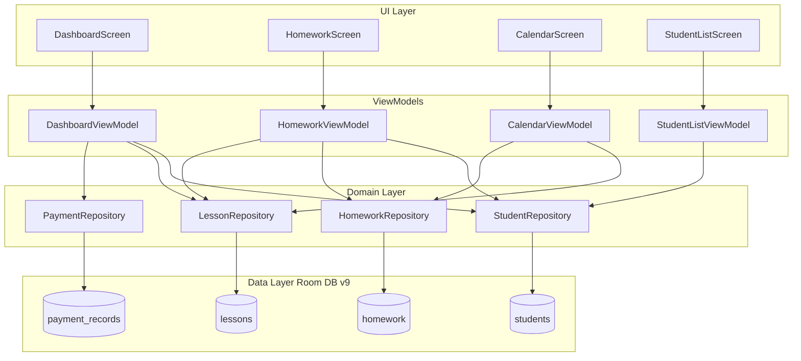

# Data Model & Schema Migration: Removal of AI Features

**Feature**: `002-remove-ai-features`  
**Date**: 2026-09-03  
**Status**: Completed  

## 1. Database Version Evolution

| Version | Description | Schema Changes |
| :--- | :--- | :--- |
| **8** (Current) | Homeworks on Calendar & Student profile additions | Includes `ai_insights` table alongside core entities. |
| **9** (Target) | Complete removal of AI features & 100% local operation | Drops `ai_insights` table. Retains all core entities unchanged. |

---

## 2. Decommissioned Entity: `AiInsightEntity`

### Table Name
`ai_insights` (DROPPED in migration `MIGRATION_8_9`)

### Historical Schema (Version 8)
```sql
CREATE TABLE IF NOT EXISTS `ai_insights` (
    `studentId` INTEGER NOT NULL,
    `focus` TEXT NOT NULL,
    `localeTag` TEXT NOT NULL,
    `insight` TEXT NOT NULL,
    `createdAtEpochMs` INTEGER NOT NULL,
    PRIMARY KEY(`studentId`, `focus`, `localeTag`)
);
```

### Decommission Action
```kotlin
val MIGRATION_8_9 = object : Migration(8, 9) {
    override fun migrate(database: SupportSQLiteDatabase) {
        database.execSQL("DROP TABLE IF EXISTS ai_insights")
    }
}
```

---

## 3. Preserved Entities (Unchanged in Version 9)

### 3.1 StudentEntity (`students`)
Represents the core student profile.

| Column | Type | Nullable | Description |
| :--- | :--- | :---: | :--- |
| `id` | INTEGER | No (PK) | Auto-generated unique ID. |
| `fullName` | TEXT | No | Student's full name. |
| `parentName` | TEXT | Yes | Name of parent/guardian. |
| `parentContact` | TEXT | Yes | Phone/email/contact for parent. |
| `notes` | TEXT | Yes | Tutor's private pedagogical notes. |
| `hourlyRate` | REAL | No | Default base hourly rate. |
| `customHourlyRate` | REAL | Yes | Customized rate override. |

### 3.2 LessonEntity (`lessons`)
Represents a scheduled, completed, or paid tutoring session.

| Column | Type | Nullable | Description |
| :--- | :--- | :---: | :--- |
| `id` | INTEGER | No (PK) | Auto-generated unique ID. |
| `studentId` | INTEGER | No (FK) | Reference to `students.id`. |
| `dateEpochMs` | INTEGER | No | Timestamp of the lesson start. |
| `durationMinutes` | INTEGER | No | Duration of lesson in minutes. |
| `status` | TEXT | No | Enum: `SCHEDULED`, `COMPLETED`, `PAID`, `CANCELLED`. |
| `topic` | TEXT | Yes | Lesson topic/notes. |
| `hourlyRate` | REAL | No | Hourly rate applied to this session. |

### 3.3 HomeworkEntity (`homework`)
Represents assignments given to students.

| Column | Type | Nullable | Description |
| :--- | :--- | :---: | :--- |
| `id` | INTEGER | No (PK) | Auto-generated unique ID. |
| `studentId` | INTEGER | No (FK) | Reference to `students.id`. |
| `title` | TEXT | No | Homework title. |
| `description` | TEXT | No | Homework instructions. |
| `creationDate` | INTEGER | No | Creation timestamp. |
| `dueDate` | INTEGER | No | Due date timestamp. |
| `status` | TEXT | No | Enum: `PENDING`, `COMPLETED`, `OVERDUE`, `CANCELLED`. |
| `performanceNotes` | TEXT | Yes | Optional tutor feedback notes. |

### 3.4 PaymentRecordEntity (`payment_records`)
Represents financial transaction logs.

| Column | Type | Nullable | Description |
| :--- | :--- | :---: | :--- |
| `id` | INTEGER | No (PK) | Auto-generated unique ID. |
| `studentId` | INTEGER | No (FK) | Reference to `students.id`. |
| `paidAtEpochMs` | INTEGER | No | Timestamp when payment was marked. |
| `amountPaid` | REAL | No | Amount paid. |
| `lessonsCoveredCount` | INTEGER | No | Number of lessons covered. |
| `totalHoursCovered` | REAL | No | Total hours settled. |

---

## 4. Entity Lifecycle & Data Flow Post-AI



*Note: All AI nodes, trackers, caches, and background generators are eliminated.*
