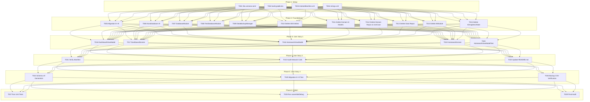

# Tasks: Complete Removal of AI Features & Pure Local-Only Operation

**Input**: Design documents from `/specs/002-remove-ai-features/`  
**Prerequisites**: plan.md ✅, spec.md ✅, research.md ✅, data-model.md ✅, quickstart.md ✅, contracts/ ✅  

**Tests**: Unit tests and migration tests are included to ensure non-destructive Room migration (v8 → v9) and clean ViewModel test suites per Constitution Principles I, VII, and Testing Expectations.

**Organization**: Tasks are grouped by user story to enable independent implementation and testing of each story.

## Format: `[ID] [P?] [Story] Description with file path`

- **[P]**: Can run in parallel (different files, no dependencies)
- **[Story]**: Which user story this task belongs to (e.g., [US1], [US2], [US3])
- Include exact file paths in descriptions

---

## Phase 1: Setup (Shared Infrastructure)

**Purpose**: Build configuration, permissions, and localization cleanup that all subsequent tasks depend on

- [x] T001 [P] Remove `generativeAi` version and `google-ai-generativeai` library declaration from `gradle/libs.versions.toml`
- [x] T002 [P] Remove `GEMINI_API_KEY` buildConfigField and `libs.google.ai.generativeai` dependency from `app/build.gradle.kts`
- [x] T003 [P] Remove `android.permission.INTERNET` from `app/src/main/AndroidManifest.xml`
- [x] T004 [P] Remove all 13 AI-related string resources from `app/src/main/res/values/strings.xml`, `app/src/main/res/values-tr/strings.xml`, and `app/src/main/res/values-de/strings.xml`

---

## Phase 2: Foundational (Blocking Prerequisites)

**Purpose**: Core data layer, database migration, and complete removal of domain/data AI classes

**⚠️ CRITICAL**: Must complete before user story UI and ViewModel modifications

- [x] T005 Add `MIGRATION_8_9` dropping table `ai_insights` in `app/src/main/java/com/barutdev/kora/data/local/migrations/StudentMigrations.kt`
- [x] T006 Update `KoraDatabase.kt` to version 9, remove `AiInsightEntity` from entities array, and remove `abstract fun aiInsightDao(): AiInsightDao` in `app/src/main/java/com/barutdev/kora/data/local/KoraDatabase.kt`
- [x] T007 Update `DatabaseModule.kt` to add `MIGRATION_8_9` to Room database builder and remove `provideAiInsightDao` in `app/src/main/java/com/barutdev/kora/di/DatabaseModule.kt`
- [x] T008 [P] Remove `provideAiInsightDao` from `app/src/androidTest/java/com/barutdev/kora/di/TestDatabaseModule.kt`
- [x] T009 [P] Remove `aiInsightDao` parameter and all `aiInsightDao.deleteAll()` invocations from `app/src/main/java/com/barutdev/kora/data/backup/DataBackupManager.kt`
- [x] T010 [P] Delete `AiInsightEntity.kt` in `app/src/main/java/com/barutdev/kora/data/local/entity/AiInsightEntity.kt` and `AiInsightDao.kt` in `app/src/main/java/com/barutdev/kora/data/local/AiInsightDao.kt`
- [x] T011 [P] Delete all domain AI models in `app/src/main/java/com/barutdev/kora/domain/model/ai/` (`AiInsightsFocus.kt`, `AiInsightsResult.kt`, `CachedAiInsight.kt`, `AiInsightsComputation.kt`, `AiInsightsSignatureBuilder.kt`, `AiInsightsRequestKey.kt`)
- [x] T012 [P] Delete domain repositories, use case, and exception in `app/src/main/java/com/barutdev/kora/domain/repository/AiRepository.kt`, `AiInsightsCacheRepository.kt`, `AiInsightsGenerationTracker.kt`, `app/src/main/java/com/barutdev/kora/domain/usecase/GenerateAiInsightsUseCase.kt`, and `app/src/main/java/com/barutdev/kora/domain/exception/AiException.kt`
- [x] T013 [P] Delete data repository implementations in `app/src/main/java/com/barutdev/kora/data/repository/AiRepositoryImpl.kt`, `AiInsightsCacheRepositoryImpl.kt`, and `AiInsightsGenerationTrackerImpl.kt`
- [x] T014 [P] Delete `AiModule.kt` in `app/src/main/java/com/barutdev/kora/di/AiModule.kt` and remove AI repository bindings from `app/src/main/java/com/barutdev/kora/di/RepositoryModule.kt`
- [x] T015 [P] Delete `AiInsightsUiState.kt` in `app/src/main/java/com/barutdev/kora/ui/model/AiInsightsUiState.kt`

**Checkpoint**: Core foundation cleaned — all backend/domain/data AI components permanently removed.

---

## Phase 3: User Story 1 — Distraction-Free, Fully Local Tutor Management (Priority: P1) 🎯 MVP

**Goal**: Eliminate AI cards, generation triggers, and background jobs from Dashboard and Homework screens, allowing core tutoring content to naturally reflow.

**Independent Test**: Launch the app, navigate to Dashboard, Student Profiles, and Homework screens. Verify no AI cards or generation buttons appear, and all core tutor actions (adding lessons, toggling homework) remain fully responsive.

### Implementation for User Story 1

- [x] T016 [US1] Remove AI repository and use case injections, `aiInsightsState` StateFlow, `aiInsightsJob`, and `ensureAiInsights`/`retryAiInsights` methods from `app/src/main/java/com/barutdev/kora/ui/screens/dashboard/DashboardViewModel.kt`
- [x] T017 [US1] Remove `AiAssistantCard` composable and `aiInsightsState`/`onGenerateAiInsights` parameters from `app/src/main/java/com/barutdev/kora/ui/screens/dashboard/DashboardScreen.kt`
- [x] T018 [US1] Remove AI repository and use case injections, `aiInsightsState` StateFlow, and `ensureAiInsights`/`retryAiInsights` methods from `app/src/main/java/com/barutdev/kora/ui/screens/homework/HomeworkViewModel.kt`
- [x] T019 [US1] Remove `AiAssistantCard` composable and `aiInsightsState`/`onGenerateAiInsights` parameters from `app/src/main/java/com/barutdev/kora/ui/screens/homework/HomeworkScreen.kt`
- [x] T020 [US1] Update `HomeworkViewModelTest.kt` in `app/src/test/java/com/barutdev/kora/ui/screens/homework/HomeworkViewModelTest.kt` to remove AI repository test fakes and AI parameters

**Checkpoint**: User Story 1 complete — UI is distraction-free, 100% local, and displays zero AI elements.

---

## Phase 4: User Story 2 — Complete Data Sovereignty & Offline Independence (Priority: P2)

**Goal**: Guarantee that the app operates 100% locally with zero network permissions, zero cloud calls, and complete offline air-gapped security.

**Independent Test**: Audit the merged Android manifest and runtime behavior in Airplane mode to verify zero network requests and zero network permission requirements.

### Implementation for User Story 2

- [x] T021 [US2] Verify merged `AndroidManifest.xml` contains zero `INTERNET` permissions via `./gradlew processDebugManifest`
- [x] T022 [US2] Audit all ViewModels and use cases to verify zero network calls and complete offline execution
- [x] T023 [US2] Update `README.md` to remove Gemini AI setup instructions, API key documentation, and feature descriptions, documenting Kora as a 100% offline private tutoring tracking app

**Checkpoint**: User Story 2 complete — application is guaranteed 100% offline and air-gapped.

---

## Phase 5: User Story 3 — Seamless Upgrade & Historical Data Preservation (Priority: P3)

**Goal**: Verify non-destructive database evolution from Room v8 to v9, ensuring existing student, lesson, homework, and payment records remain completely intact.

**Independent Test**: Run Room compilation to generate schema version 9, verify `ai_insights` is dropped, and run migration tests.

### Implementation for User Story 3

- [x] T024 [US3] Generate Room database schema version 9 and verify absence of `ai_insights` table in `app/schemas/com.barutdev.kora.data.local.KoraDatabase/9.json` via `./gradlew kspDebugKotlin`
- [x] T025 [US3] Create automated migration unit test verifying `MIGRATION_8_9` drops `ai_insights` while preserving students, lessons, homework, and payment records in `app/src/androidTest/java/com/barutdev/kora/data/local/Migration8to9Test.kt`
- [x] T026 [US3] Verify `DataBackupManager` CSV export and import operate cleanly without AI insight records

**Checkpoint**: User Story 3 complete — database upgrade verified and data preservation guaranteed.

---

## Phase 6: Polish & Cross-Cutting Concerns

**Purpose**: Final verification, testing, and clean build checks

- [x] T027 Run all unit tests via `./gradlew testDebugUnitTest` to ensure clean test execution across all modules
- [x] T021 [US1] Run `./gradlew assembleDebug` to verify project compiles cleanly
- [x] T022 [US1] Inspect log output to ensure no unresolved AI references exist
- [x] T029 Perform final codebase audit for any remaining mentions of Gemini, `ai_insights`, or `AiModule`

---

## Dependencies & Execution Order

---

## Parallel Execution Opportunities

- **Phase 1 (Setup)**: `T001`, `T002`, `T003`, `T004` can all be executed in parallel (different configuration files).
- **Phase 2 (Foundational Deletions)**: `T008`, `T009`, `T010`, `T011`, `T012`, `T013`, `T014`, `T015` can be executed in parallel once `T005`, `T006`, `T007` are established.
- **Phase 3 (User Story 1 UI)**: `T016` (Dashboard VM) & `T018` (Homework VM) can run in parallel; `T017` (Dashboard Screen) & `T019` (Homework Screen) can run in parallel.
- **Phase 4 & 5**: User Story 2 documentation/manifest checks and User Story 3 migration tests can run independently once User Story 1 compiles.

---

## Implementation Strategy & MVP Scope

- **MVP Scope**: **Phase 1 (Setup) + Phase 2 (Foundational) + Phase 3 (User Story 1)**. Completing these phases immediately removes all AI features, restores a clean local UI, and allows the app to compile and run with 100% local functionality.
- **Incremental Delivery**:
  1. *Increment 1*: Build & dependency decoupling (Phases 1 & 2).
  2. *Increment 2*: UI reflow and distraction-free screens (Phase 3 — MVP).
  3. *Increment 3*: Air-gapped validation and documentation update (Phase 4).
  4. *Increment 4*: Room migration unit test verification and full test suite pass (Phases 5 & 6).
