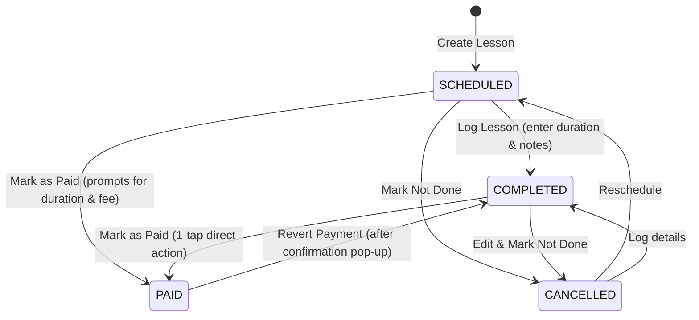

# Phase 1: Data Model & State Transitions

**Branch**: `003-calendar-mark-lesson-paid`  
**Date**: 2026-09-04  
**Feature**: [spec.md](file:///home/halit/AndroidStudioProjects/Kora/specs/003-calendar-mark-lesson-paid/spec.md)

## Entities

### 1. `Lesson` (Domain) / `LessonEntity` (Data / Room)

Represents a tutoring session.

| Field | Type | Nullable | Description |
|---|---|---|---|
| `id` | `Int` | No | Unique lesson identifier (Primary Key, autogenerated) |
| `studentId` | `Int` | No | Foreign key referencing `students.id` with `CASCADE` delete |
| `date` | `Long` | No | Epoch millisecond timestamp of the lesson date/time |
| `status` | `LessonStatus` | No | Enum: `SCHEDULED`, `COMPLETED`, `CANCELLED`, `PAID` |
| `durationInHours` | `Double` | Yes | Lesson duration in hours (e.g., 1.5). Required when `COMPLETED` or `PAID` |
| `notes` | `String` | Yes | Optional tutor notes / lesson summary |
| `paymentTimestamp` | `Long` | Yes | Epoch timestamp when the lesson was paid. Matches `paidAtEpochMs` in `payment_records` |

#### Invariants:
- A lesson in `PAID` status MUST have `durationInHours != null && durationInHours > 0.0`.
- A lesson in `PAID` status MUST have `paymentTimestamp != null`.
- When a lesson transitions to `PAID`, its monetary amount (`durationInHours * effectiveRate`) is excluded from the active unpaid payment cycle.
- While in `PAID` status, the `durationInHours` field is locked (read-only); modifying duration requires reverting the payment first.

---

### 2. `PaymentRecord` (Domain) / `PaymentRecordEntity` (Data / Room)

Represents a logged financial payment transaction.

| Field | Type | Nullable | Description |
|---|---|---|---|
| `id` | `Int` | No | Unique record identifier (Primary Key, autogenerated) |
| `studentId` | `Int` | No | Foreign key referencing `students.id` with `CASCADE` delete |
| `amountMinor` | `Long` | No | Total amount paid in minor currency units (e.g., cents, kuruş: `150.00` → `15000L`) |
| `paidAtEpochMs` | `Long` | No | Timestamp of the payment transaction |

#### Invariants:
- `amountMinor` MUST be strictly greater than 0 (`amountMinor > 0L`).
- Composite index on `[studentId, paidAtEpochMs]` ensures rapid query and deletion during reversal.

---

### 3. `Student` (Domain) / `StudentEntity` (Data / Room)

Represents the student profile and financial settings.

| Field | Type | Nullable | Description |
|---|---|---|---|
| `id` | `Int` | No | Unique student identifier |
| `fullName` | `String` | No | Student full name |
| `customHourlyRate` | `Double` | Yes | Student-specific hourly rate override (if null, falls back to `defaultHourlyRate`) |
| `lastPaymentDate` | `Long` | Yes | Timestamp of the most recent payment received for this student |

---

## State Transitions

### Lifecycle Diagram

---

### State Transition Specifications

#### 1. `COMPLETED` → `PAID`
- **Trigger**: User taps the green "Mark as Paid" button on a completed lesson card.
- **Pre-conditions**:
  - Lesson is in `COMPLETED` status.
  - Lesson has a valid `durationInHours > 0.0`.
  - Effective hourly rate (`customHourlyRate ?: defaultHourlyRate`) > 0.0, or user inputs custom session fee if rate is 0.
- **Database Operations** (executed atomically inside `KoraDatabase.withTransaction`):
  1. `now = System.currentTimeMillis()`
  2. Insert `PaymentRecordEntity(studentId, amountMinor, paidAtEpochMs = now)`
  3. Update `LessonEntity` with `status = PAID, paymentTimestamp = now`
  4. Update `StudentEntity.lastPaymentDate = now`
- **Side Effects**:
  - Lesson amount is immediately deducted from the student's active payment cycle balance.
  - Button on card transforms into outlined "Revert Payment".

#### 2. `SCHEDULED` → `PAID`
- **Trigger**: User taps the green "Mark as Paid" button on a scheduled lesson card.
- **Pre-conditions**:
  - Lesson is in `SCHEDULED` status.
- **Interactive Prompt**:
  - System presents duration dialog (with rate/fee prompt if effective rate is 0).
  - User enters duration (and fee if prompted) and confirms.
- **Database Operations** (executed atomically inside `KoraDatabase.withTransaction`):
  1. `now = System.currentTimeMillis()`
  2. Insert `PaymentRecordEntity(studentId, amountMinor, paidAtEpochMs = now)`
  3. Update `LessonEntity` with `status = PAID, durationInHours = inputDuration, notes = inputNotes, paymentTimestamp = now`
  4. Update `StudentEntity.lastPaymentDate = now`
  5. Cancel any scheduled notification alarms for this lesson (`cancelNotificationAlarmsUseCase(lessonId)`).
- **Side Effects**:
  - Lesson is marked paid directly without dwelling in unpaid completed state.

#### 3. `PAID` → `COMPLETED` (Reversal)
- **Trigger**: User taps the outlined "Revert Payment" button on a paid lesson card.
- **Interactive Prompt**:
  - System presents confirmation pop-up:
    - *Title*: "Revert Payment?"
    - *Message*: "Reverting will mark this lesson as unpaid and remove this payment from the student's payment history."
    - *Confirm*: "Revert" | *Dismiss*: "Cancel"
- **Pre-conditions**:
  - Lesson is in `PAID` status.
  - User confirms reversal in pop-up dialog.
- **Database Operations** (executed atomically inside `KoraDatabase.withTransaction`):
  1. If `lesson.paymentTimestamp != null`:
     - Delete from `payment_records` where `studentId = lesson.studentId AND paidAtEpochMs = lesson.paymentTimestamp`.
  2. Update `LessonEntity` with `status = COMPLETED, paymentTimestamp = null`.
  3. Find the most recent remaining `PaymentRecordEntity` for this student:
     - If found: update `StudentEntity.lastPaymentDate = latest.paidAtEpochMs`.
     - If none: update `StudentEntity.lastPaymentDate = null`.
- **Side Effects**:
  - Lesson's monetary value is added back to the student's active unpaid cycle.
  - Button on card transforms back to green "Mark as Paid".
  - Historical payment record is removed from student's payment history view.
