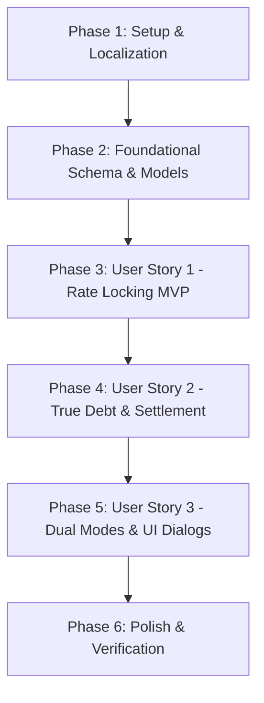

# Tasks: Lesson Rate Locking and Historical Payment Calculation

**Input**: Design documents from `/specs/004-lesson-rate-locking/`  
**Prerequisites**: [plan.md](file:///home/halit/AndroidStudioProjects/Kora/specs/004-lesson-rate-locking/plan.md), [spec.md](file:///home/halit/AndroidStudioProjects/Kora/specs/004-lesson-rate-locking/spec.md), [research.md](file:///home/halit/AndroidStudioProjects/Kora/specs/004-lesson-rate-locking/research.md), [data-model.md](file:///home/halit/AndroidStudioProjects/Kora/specs/004-lesson-rate-locking/data-model.md), [contracts/](file:///home/halit/AndroidStudioProjects/Kora/specs/004-lesson-rate-locking/contracts/), [quickstart.md](file:///home/halit/AndroidStudioProjects/Kora/specs/004-lesson-rate-locking/quickstart.md)

## Format: `- [ ] [TaskID] [P?] [Story?] Description with file path`

- **[P]**: Can run in parallel (different files, no dependencies on incomplete tasks)
- **[Story]**: User story identifier ([US1], [US2], [US3])
- Exact file paths included in every task

---

## Phase 1: Setup (Shared Infrastructure & Localization)

**Purpose**: Localization strings, domain enums, and Room TypeConverter

- [X] T001 [P] Add English strings for pricing modes ("Per Hour", "Flat Fee"), rate change dialogs, and fee labels in `app/src/main/res/values/strings.xml`
- [X] T002 [P] Add Turkish strings for pricing modes, rate change dialogs, and fee labels in `app/src/main/res/values-tr/strings.xml`
- [X] T003 [P] Add German strings for pricing modes, rate change dialogs, and fee labels in `app/src/main/res/values-de/strings.xml`
- [X] T004 [P] Create `PricingMode` enum (`PER_HOUR`, `FLAT_FEE`) in `app/src/main/java/com/barutdev/kora/domain/model/PricingMode.kt`
- [X] T005 [P] Create `PricingModeConverter` Room TypeConverter in `app/src/main/java/com/barutdev/kora/data/local/PricingModeConverter.kt`

---

## Phase 2: Foundational (Blocking Prerequisites)

**Purpose**: Core data layer schema migration, entity updates, and repository methods that MUST be completed before any user story work

**⚠️ CRITICAL**: All user stories depend on this data layer foundation

- [X] T006 Update `LessonEntity` with `pricingMode` and `rateOrFee` columns in `app/src/main/java/com/barutdev/kora/data/local/entity/LessonEntity.kt`
- [X] T007 Update domain model `Lesson` with `pricingMode`, `rateOrFee`, and computed `calculatedValue` in `app/src/main/java/com/barutdev/kora/domain/model/Lesson.kt`
- [X] T008 Update `LessonMapper` to map `pricingMode` and `rateOrFee` between `LessonEntity` and `Lesson` in `app/src/main/java/com/barutdev/kora/data/mapper/LessonMapper.kt`
- [X] T009 Implement `MIGRATION_9_10` to add columns and backfill legacy lessons using each student's active rate in `app/src/main/java/com/barutdev/kora/data/local/migrations/StudentMigrations.kt`
- [X] T010 Register `PricingModeConverter`, increment database version to 10, and attach `MIGRATION_9_10` in `app/src/main/java/com/barutdev/kora/data/local/KoraDatabase.kt` and `app/src/main/java/com/barutdev/kora/di/DatabaseModule.kt`
- [X] T011 Add `getScheduledLessonCount` and `updateScheduledLessonsRate` queries in `app/src/main/java/com/barutdev/kora/data/local/LessonDao.kt`
- [X] T012 Update `LessonRepository` interface and `LessonRepositoryImpl` to support scheduled lesson count and rate updates in `app/src/main/java/com/barutdev/kora/domain/repository/LessonRepository.kt` and `app/src/main/java/com/barutdev/kora/data/repository/LessonRepositoryImpl.kt`
- [X] T013 [P] Create automated Room migration test `Migration9to10Test` verifying schema 9 to 10 evolution and legacy rate backfills in `app/src/androidTest/java/com/barutdev/kora/data/local/Migration9to10Test.kt`

**Checkpoint**: Foundation ready — database schema v10 active, models compiled, migrations verified.

---

## Phase 3: User Story 1 - Preserving Historical Rates for Completed Unpaid Lessons (Priority: P1) 🎯 MVP

**Goal**: Prevent retroactive recalculation of past completed lessons when a student's profile hourly rate changes, locking historical snapshots.

**Independent Test**: Complete a 2h lesson at $30/hr ($60 value), update student profile rate to $50/hr, and verify that the completed lesson and student balance remain exactly $60.

### Tests for User Story 1
- [X] T014 [P] [US1] Unit test `Lesson.calculatedValue` under `PER_HOUR` and `FLAT_FEE` modes in `app/src/test/java/com/barutdev/kora/domain/model/LessonTest.kt`
- [X] T015 [P] [US1] Unit test non-retroactive snapshot rate persistence in `app/src/test/java/com/barutdev/kora/data/repository/LessonRepositoryImplTest.kt`

### Implementation for User Story 1
- [X] T016 [US1] Update `PaymentRepositoryImpl.markLessonAsPaid` to record payment using `lesson.calculatedValue` (or custom fee override) in `app/src/main/java/com/barutdev/kora/data/repository/PaymentRepositoryImpl.kt`
- [X] T017 [US1] Update `CalendarViewModel.saveLesson` and lesson logging to snapshot the student's active rate at creation in `app/src/main/java/com/barutdev/kora/ui/screens/calendar/CalendarViewModel.kt`
- [X] T018 [US1] Update `DashboardViewModel` `saveLesson` and lesson logging to capture the snapshot rate in `app/src/main/java/com/barutdev/kora/ui/screens/dashboard/DashboardViewModel.kt`

**Checkpoint**: MVP Complete — Completed lessons retain their snapshot rate; profile rate changes no longer retroactively alter past completed sessions.

---

## Phase 4: User Story 2 - Accurate Cumulative Debt and Payment Cycle Settlement (Priority: P2)

**Goal**: Compute cumulative debt and full payment cycle settlements by summing `Σ lesson.calculatedValue`, supporting multi-rate lesson histories.

**Independent Test**: Complete Lesson 1 (1 hr at $30/hr) and Lesson 2 (1 hr at $40/hr); verify total debt equals $70 ($30 + $40) and full cycle settlement records exactly $70.

### Tests for User Story 2
- [X] T019 [P] [US2] Update `PaymentRepositoryImplTest` to verify full cycle settlement (`markStudentAsPaid`) with multi-rate lessons in `app/src/test/java/com/barutdev/kora/data/repository/PaymentRepositoryImplTest.kt`
- [X] T020 [P] [US2] Update `StudentListViewModelTest` to verify student debt calculation sums `lesson.calculatedValue` in `app/src/test/java/com/barutdev/kora/ui/screens/student_list/StudentListViewModelTest.kt`
- [X] T021 [P] [US2] Update `DashboardViewModelTest` to verify `totalAmountDue` sums `lesson.calculatedValue` in `app/src/test/java/com/barutdev/kora/ui/screens/dashboard/DashboardViewModelTest.kt`

### Implementation for User Story 2
- [X] T022 [US2] Refactor `PaymentRepositoryImpl.markStudentAsPaid` to record payment of `completedLessons.sumOf { it.calculatedValue }` in `app/src/main/java/com/barutdev/kora/data/repository/PaymentRepositoryImpl.kt`
- [X] T023 [US2] Refactor `StudentListViewModel` to compute debt as `completedLessons.sumOf { it.calculatedValue }` in `app/src/main/java/com/barutdev/kora/ui/screens/student_list/StudentListViewModel.kt`
- [X] T024 [US2] Refactor `DashboardViewModel` to compute `totalAmountDue` as `computation.completedLessons.sumOf { it.calculatedValue }` in `app/src/main/java/com/barutdev/kora/ui/screens/dashboard/DashboardViewModel.kt`

**Checkpoint**: Outstanding balances and payment settlements accurately reflect the sum of individual lesson snapshots across all screens.

---

## Phase 5: User Story 3 - Per-Lesson Rate Transparency, Dual Modes, and Manual Editing (Priority: P3)

**Goal**: Provide pricing mode toggle ("Per Hour" vs "Flat Fee") in lesson dialogs, display snapshot fees in cards, and prompt the tutor when changing student profile rate if future scheduled lessons exist.

**Independent Test**: Schedule a flat-fee lesson ($25 flat), verify debt increases by $25; change student profile rate when scheduled lessons exist and verify the confirmation prompt appears.

### Tests for User Story 3
- [X] T025 [P] [US3] Unit test `EditStudentProfileViewModel` scheduled lessons prompt trigger and choices in `app/src/test/java/com/barutdev/kora/ui/screens/student_profile/EditStudentProfileViewModelTest.kt`

### Implementation for User Story 3
- [X] T026 [P] [US3] Create `ScheduledLessonsRatePromptDialog` composable in `app/src/main/java/com/barutdev/kora/ui/screens/student_profile/components/ScheduledLessonsRatePromptDialog.kt`
- [X] T027 [P] [US3] Update `AddLessonDialog` to include pricing mode selector (`PER_HOUR` / `FLAT_FEE`) and rate/fee input in `app/src/main/java/com/barutdev/kora/ui/screens/dashboard/components/AddLessonDialog.kt`
- [X] T028 [P] [US3] Update `LogLessonDialog` to support editing pricing mode and rate/fee for unpaid completed lessons in `app/src/main/java/com/barutdev/kora/ui/screens/dashboard/components/LogLessonDialog.kt`
- [X] T029 [US3] Update `EditStudentProfileViewModel` to check for scheduled lessons on rate change and expose prompt dialog state in `app/src/main/java/com/barutdev/kora/ui/screens/student_profile/EditStudentProfileViewModel.kt`
- [X] T030 [US3] Integrate `ScheduledLessonsRatePromptDialog` into `EditStudentProfileScreen` in `app/src/main/java/com/barutdev/kora/ui/screens/student_profile/EditStudentProfileScreen.kt`
- [X] T031 [US3] Update Calendar and Dashboard lesson cards to display the lesson's pricing mode and calculated total in `app/src/main/java/com/barutdev/kora/ui/screens/calendar/CalendarScreen.kt` and `app/src/main/java/com/barutdev/kora/ui/screens/dashboard/DashboardScreen.kt`

**Checkpoint**: Full pricing flexibility enabled with dual modes, manual editing, and interactive scheduled lesson rate updates.

---

## Phase 6: Polish & Cross-Cutting Concerns

**Purpose**: Verification, code health, and regression testing

- [X] T032 [P] Run static analysis and lint checks across Kotlin files
- [X] T033 Execute all unit tests (`./gradlew testDebugUnitTest`) to ensure zero regressions
- [X] T034 Perform end-to-end verification walkthrough per `specs/004-lesson-rate-locking/quickstart.md`

---

## Dependencies & Execution Order

### Parallel Execution Opportunities
- **Phase 1**: T001, T002, T003 (localization files) and T004, T005 (enums & converters) can all execute in parallel.
- **Phase 2**: T013 (migration test) can be written in parallel with T011, T012.
- **Phase 3**: T014, T015 (unit tests) can execute in parallel before implementation.
- **Phase 4**: T019, T020, T021 (unit tests) can be updated in parallel.
- **Phase 5**: T026 (`ScheduledLessonsRatePromptDialog`), T027 (`AddLessonDialog`), and T028 (`LogLessonDialog`) can be developed in parallel.

### Implementation Strategy
- **MVP Delivery**: Complete Phases 1, 2, and 3 (T001–T018). This immediately halts retroactive rate recalculation and fixes the tutor's primary problem.
- **Incremental Value**:
  - Phase 4 delivers accurate cumulative accounting across multi-rate cycles.
  - Phase 5 adds rich UI flexibility (flat fees, one-off overrides, and scheduled rate updates).
