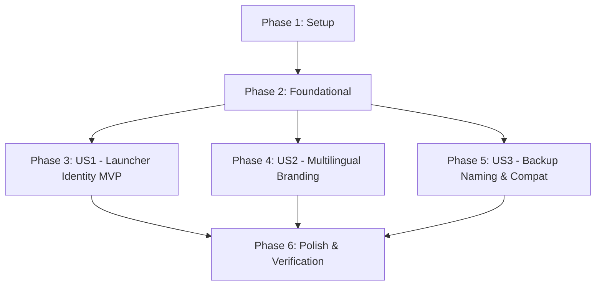

# Tasks: Application Rebranding to "Tullab"

**Input**: Design artifacts from `specs/006-rename-app-tullab/`  
**Status**: Ready for execution

---

## Phase 1: Setup (Shared Infrastructure)

**Purpose**: Project initialization, Gradle metadata, and namespace configuration

- [x] T001 Update root project name to "Tullab" in [settings.gradle.kts](file:///home/halit/AndroidStudioProjects/Kora/settings.gradle.kts)
- [x] T002 Update namespace and applicationId to "com.barutdev.tullab" in [app/build.gradle.kts](file:///home/halit/AndroidStudioProjects/Kora/app/build.gradle.kts)

---

## Phase 2: Foundational (Blocking Prerequisites)

**Purpose**: Complete codebase package relocation, class renaming, and core component refactoring  
**⚠️ CRITICAL**: No user story work can begin until this phase is complete

- [x] T003 Relocate source directory trees from `com/barutdev/kora` to `com/barutdev/tullab` in `app/src/main/java/`, `app/src/test/java/`, and `app/src/androidTest/java/`
- [x] T004 Update package declarations, imports, and inline fully-qualified symbol references (converting all `com.barutdev.kora.*` to `com.barutdev.tullab.*`) across all Kotlin source files in `app/src/main/java/com/barutdev/tullab/`
- [x] T005 [P] Update package declarations and import statements across all unit test files in `app/src/test/java/com/barutdev/tullab/`
- [x] T006 [P] Update package declarations and import statements across all instrumented test files in `app/src/androidTest/java/com/barutdev/tullab/`
- [x] T007 Rename application class `KoraApp.kt` to `TullabApp.kt` in [app/src/main/java/com/barutdev/tullab/TullabApp.kt](file:///home/halit/AndroidStudioProjects/Kora/app/src/main/java/com/barutdev/tullab/TullabApp.kt)
- [x] T008 Rename database class `KoraDatabase.kt` to `TullabDatabase.kt` in [app/src/main/java/com/barutdev/tullab/data/local/TullabDatabase.kt](file:///home/halit/AndroidStudioProjects/Kora/app/src/main/java/com/barutdev/tullab/data/local/TullabDatabase.kt), update `DATABASE_NAME` to `"tullab.db"` in [app/src/main/java/com/barutdev/tullab/di/DatabaseModule.kt](file:///home/halit/AndroidStudioProjects/Kora/app/src/main/java/com/barutdev/tullab/di/DatabaseModule.kt), and copy/rename Room schema directory from `app/schemas/com.barutdev.kora.data.local.KoraDatabase` to `app/schemas/com.barutdev.tullab.data.local.TullabDatabase`
- [x] T009 Rename navigation classes `KoraNavGraph.kt` and `KoraDestination.kt` to `TullabNavGraph.kt` and `TullabDestination.kt` in `app/src/main/java/com/barutdev/tullab/navigation/`
- [x] T010 Rename theme composable `KoraTheme` to `TullabTheme` in [app/src/main/java/com/barutdev/tullab/ui/theme/Theme.kt](file:///home/halit/AndroidStudioProjects/Kora/app/src/main/java/com/barutdev/tullab/ui/theme/Theme.kt) and update usage in [app/src/main/java/com/barutdev/tullab/MainActivity.kt](file:///home/halit/AndroidStudioProjects/Kora/app/src/main/java/com/barutdev/tullab/MainActivity.kt)
- [x] T011 Update application class name to `.TullabApp` and theme to `@style/Theme.Tullab` in [app/src/main/AndroidManifest.xml](file:///home/halit/AndroidStudioProjects/Kora/app/src/main/AndroidManifest.xml)

**Checkpoint**: Foundation ready — all packages and core symbols reflect `com.barutdev.tullab`.

---

## Phase 3: User Story 1 - App Identity on Device and Launcher (Priority: P1) 🎯 MVP

**Goal**: Deliver the official "Tullab" launcher identity, icon, and system display labels  
**Independent Test**: Install the app on an Android device or emulator; verify that the launcher label displays "Tullab" and the icon displays the Tullab emblem on a crisp white background.

- [x] T012 [P] [US1] Create solid white launcher background drawable in [app/src/main/res/drawable/ic_launcher_background.xml](file:///home/halit/AndroidStudioProjects/Kora/app/src/main/res/drawable/ic_launcher_background.xml)
- [x] T013 [P] [US1] Create adaptive icon foreground wrapper with safe-zone insets around `drawable/tullab.xml` in [app/src/main/res/drawable/ic_launcher_tullab_foreground.xml](file:///home/halit/AndroidStudioProjects/Kora/app/src/main/res/drawable/ic_launcher_tullab_foreground.xml)
- [x] T014 [US1] Configure adaptive launcher icons to bind white background and `ic_launcher_tullab_foreground` in [app/src/main/res/mipmap-anydpi-v26/ic_launcher.xml](file:///home/halit/AndroidStudioProjects/Kora/app/src/main/res/mipmap-anydpi-v26/ic_launcher.xml) and [app/src/main/res/mipmap-anydpi-v26/ic_launcher_round.xml](file:///home/halit/AndroidStudioProjects/Kora/app/src/main/res/mipmap-anydpi-v26/ic_launcher_round.xml)
- [x] T015 [P] [US1] Update application theme style name to `Theme.Tullab` in [app/src/main/res/values/themes.xml](file:///home/halit/AndroidStudioProjects/Kora/app/src/main/res/values/themes.xml)
- [x] T016 [P] [US1] Update `app_name` string to "Tullab" across [app/src/main/res/values/strings.xml](file:///home/halit/AndroidStudioProjects/Kora/app/src/main/res/values/strings.xml), [app/src/main/res/values-tr/strings.xml](file:///home/halit/AndroidStudioProjects/Kora/app/src/main/res/values-tr/strings.xml), and [app/src/main/res/values-de/strings.xml](file:///home/halit/AndroidStudioProjects/Kora/app/src/main/res/values-de/strings.xml)

**Checkpoint**: User Story 1 complete — app launcher, theme, and application label display "Tullab" with the white/gold/navy icon.

---

## Phase 4: User Story 2 - Consistent Multilingual Brand Experience (Priority: P1)

**Goal**: Deliver 100% linguistic parity for "Tullab" in welcome screens, notifications, and dialogs across English, Turkish, and German  
**Independent Test**: Switch app locale between English, Turkish, and German; verify onboarding welcome greetings and notification reminders display accurate Tullab branding.

- [x] T017 [P] [US2] Update English onboarding title and notification body to "Tullab" in [app/src/main/res/values/strings.xml](file:///home/halit/AndroidStudioProjects/Kora/app/src/main/res/values/strings.xml)
- [x] T018 [P] [US2] Update Turkish onboarding title and notification body to "Tullab" in [app/src/main/res/values-tr/strings.xml](file:///home/halit/AndroidStudioProjects/Kora/app/src/main/res/values-tr/strings.xml)
- [x] T019 [P] [US2] Update German onboarding title and notification body to "Tullab" in [app/src/main/res/values-de/strings.xml](file:///home/halit/AndroidStudioProjects/Kora/app/src/main/res/values-de/strings.xml)
- [x] T020 [US2] Verify and update notification channel name and descriptions in [app/src/main/java/com/barutdev/tullab/data/notification/NotificationBuilderImpl.kt](file:///home/halit/AndroidStudioProjects/Kora/app/src/main/java/com/barutdev/tullab/data/notification/NotificationBuilderImpl.kt)

**Checkpoint**: User Stories 1 & 2 complete — launcher identity and in-app multilingual branding are fully unified under "Tullab".

---

## Phase 5: User Story 3 - Data Backup Naming and Backward Compatibility (Priority: P2)

**Goal**: Export data backups under the `tullab_backup_` naming scheme while seamlessly importing legacy `kora_backup_` files  
**Independent Test**: Export a backup file in Settings and verify the filename begins with `tullab_backup_`; then select an older `kora_backup_*.csv` file and verify successful restore.

- [x] T021 [US3] Update default export filename generation to `tullab_backup_...csv` in [app/src/main/java/com/barutdev/tullab/ui/screens/settings/SettingsScreen.kt](file:///home/halit/AndroidStudioProjects/Kora/app/src/main/java/com/barutdev/tullab/ui/screens/settings/SettingsScreen.kt)
- [x] T022 [US3] Verify and ensure backup restoration accepts both `tullab_backup_*.csv` and legacy `kora_backup_*.csv` files in [app/src/main/java/com/barutdev/tullab/data/backup/DataBackupManager.kt](file:///home/halit/AndroidStudioProjects/Kora/app/src/main/java/com/barutdev/tullab/data/backup/DataBackupManager.kt)
- [x] T023 [P] [US3] Add unit test verifying legacy and current backup filename parsing and restoration in [app/src/test/java/com/barutdev/tullab/data/backup/DataBackupManagerTest.kt](file:///home/halit/AndroidStudioProjects/Kora/app/src/test/java/com/barutdev/tullab/data/backup/DataBackupManagerTest.kt)

**Checkpoint**: All three user stories are complete and independently testable.

---

## Phase 6: Polish & Cross-Cutting Concerns

**Purpose**: Verification, test suite execution, and documentation cleanup

- [x] T024 [P] Update project documentation and branding references in [README.md](file:///home/halit/AndroidStudioProjects/Kora/README.md)
- [x] T025 Execute full JVM unit test suite via `./gradlew testDebugUnitTest` and resolve any package reference issues
- [x] T026 Execute debug APK compilation via `./gradlew assembleDebug` and verify merged AndroidManifest package is `com.barutdev.tullab`
- [x] T027 Run quickstart verification scenarios per [quickstart.md](file:///home/halit/AndroidStudioProjects/Kora/specs/006-rename-app-tullab/quickstart.md)

---

## Dependencies & Execution Order

### Phase Dependencies

- **Phase 1 (Setup)**: Can start immediately.
- **Phase 2 (Foundational)**: Depends on Phase 1; blocks all user stories.
- **Phases 3, 4, 5 (User Stories)**: Depend on Phase 2; can proceed in priority order (US1 → US2 → US3) or in parallel.
- **Phase 6 (Polish)**: Depends on all user stories completing.

### Parallel Opportunities

- **Phase 2**: T005 (unit tests update) and T006 (instrumented tests update) can execute in parallel once source files are relocated.
- **Phase 3**: T012 (`ic_launcher_background.xml`), T013 (`ic_launcher_tullab_foreground.xml`), T015 (`themes.xml`), and T016 (`strings.xml`) can run in parallel.
- **Phase 4**: T017 (`strings.xml` EN), T018 (`strings.xml` TR), and T019 (`strings.xml` DE) can be edited in parallel.
- **Phase 5 & 6**: T023 (unit tests) and T024 (`README.md`) can run in parallel.

---

## Implementation Strategy

### MVP Scope (User Story 1 Only)
1. Complete Phase 1 (Setup) and Phase 2 (Foundational).
2. Complete Phase 3 (User Story 1: Launcher Identity & Icon).
3. **Verify**: Install APK, verify "Tullab" icon and launcher label appear correctly on home screen.

### Full Delivery
1. Proceed to Phase 4 (User Story 2: Multilingual Branding).
2. Proceed to Phase 5 (User Story 3: Backup Export & Import Compatibility).
3. Execute Phase 6 (Polish & Verification: JVM unit tests, APK assembly, quickstart verification).
