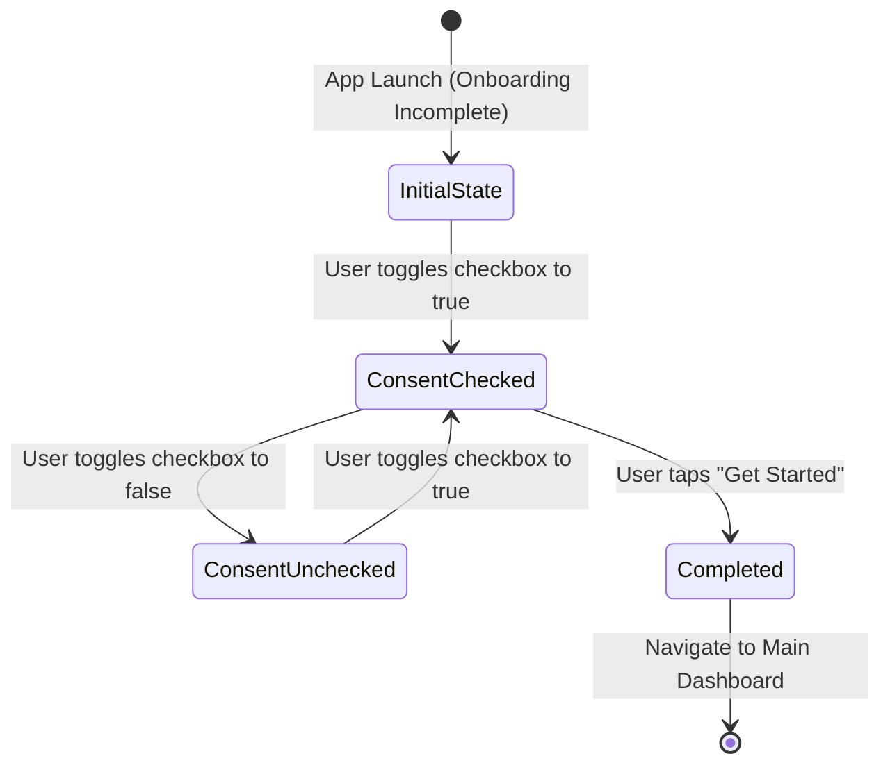

# Phase 1 Data Model: Welcome Screen Modern Redesign

**Feature**: `007-redesign-welcome-screen`  
**Date**: 2026-09-05  

## Overview

The welcome screen redesign manages presentation state for first-time user orientation and persistence of onboarding completion.

---

## Entities & Models

### 1. `FeatureHighlightItem` (Presentation Model)

Represents a core value pillar displayed on the welcome screen.

| Field | Type | Description |
| :--- | :--- | :--- |
| `icon` | `ImageVector` | Material 3 vector icon representing the capability (`Groups`, `CalendarMonth`, `Payments`) |
| `titleRes` | `@StringRes Int` | Resource ID for the localized title of the pillar |
| `descriptionRes` | `@StringRes Int` | Resource ID for the localized description of the pillar |

#### Validation & Constraints:
- Non-null, valid resource IDs across all three supported locales (English, Turkish, German).
- Purely immutable presentation model.

---

### 2. `OnboardingUiState` (Screen State)

Models the state of the single-screen welcome experience.

| Field | Type | Description |
| :--- | :--- | :--- |
| `consentChecked` | `Boolean` | Indicates whether the tutor has checked the Terms & Privacy consent checkbox |
| `isGetStartedEnabled` | `Boolean` | Derived flag: `consentChecked == true` |

#### State Transitions:

1. **InitialState**: `consentChecked = false`, `isGetStartedEnabled = false`. Primary button is disabled.
2. **ConsentChecked**: `consentChecked = true`, `isGetStartedEnabled = true`. Primary button becomes active with smooth color transition.
3. **Completed**: Triggers `SetOnboardingCompletedUseCase(true)`. State is persisted in DataStore; navigation dispatches `onCompleted()`.

---

### 3. `OnboardingPreference` (Persistence Model)

Underlying local preference managed by DataStore preferences.

| Key | Type | Default | Scope |
| :--- | :--- | :--- | :--- |
| `PREF_ONBOARDING_COMPLETED` | `Preferences.Key<Boolean>` | `false` | Global app scope (`UserPreferencesRepository`) |

#### Behavior:
- When `false`: Application start destination in `TullabNavGraph` routes to `TullabDestination.Onboarding.route`.
- When set to `true`: Saved atomically to DataStore. Subsequent app launches route directly to `TullabDestination.Dashboard.route`.
