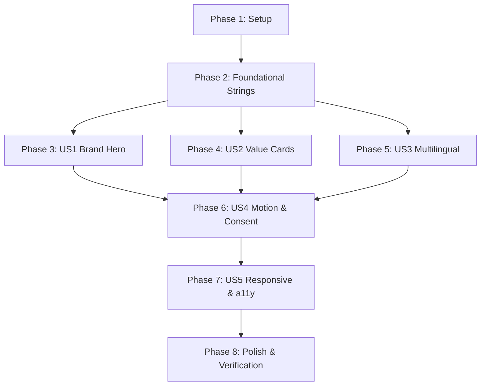

# Tasks: Welcome Screen Modern Redesign

**Branch**: `007-redesign-welcome-screen` | **Date**: 2026-09-05 | **Spec**: [specs/007-redesign-welcome-screen/spec.md](file:///home/halit/AndroidStudioProjects/Tullab/specs/007-redesign-welcome-screen/spec.md) | **Plan**: [specs/007-redesign-welcome-screen/plan.md](file:///home/halit/AndroidStudioProjects/Tullab/specs/007-redesign-welcome-screen/plan.md)

---

## Phase 1: Setup (Shared Infrastructure)

**Purpose**: Establish data models, presentation models, and unit testing scaffold.

- [ ] T001 Define `FeatureHighlightItem` presentation model in `app/src/main/java/com/barutdev/tullab/ui/screens/onboarding/FeatureHighlightItem.kt`
- [ ] T002 [P] Create unit test suite for OnboardingViewModel consent toggle and completion in `app/src/test/java/com/barutdev/tullab/ui/screens/onboarding/OnboardingViewModelTest.kt`

---

## Phase 2: Foundational (Blocking Prerequisites)

**Purpose**: Externalize all localized copy across English, Turkish, and German, correcting Turkish grammar and purging legacy AI strings.

**⚠️ CRITICAL**: String resources must be available before composable assembly begins.

- [ ] T003 [P] Externalize English welcome strings (title, subtitle, 3 value pillars) and purge obsolete AI strings in `app/src/main/res/values/strings.xml`
- [ ] T004 [P] Externalize Turkish welcome strings with grammatical correction "Tullab’a Hoş Geldiniz", subtitle, and 3 value pillars in `app/src/main/res/values-tr/strings.xml`
- [ ] T005 [P] Externalize German welcome strings (title, subtitle, 3 value pillars) and purge obsolete AI strings in `app/src/main/res/values-de/strings.xml`

**Checkpoint**: Foundation ready — all strings and models available for user story implementation.

---

## Phase 3: User Story 1 - Warm, Inspiring First-Launch Greeting & Brand Identity (Priority: P1) 🎯 MVP

**Goal**: Greet first-time tutors with a centered, beautifully balanced brand presentation featuring the official Tullab emblem vector, welcoming headline, and inspirational subtitle.

**Independent Test**: Launch the app with cleared onboarding data; verify the screen renders the official Tullab emblem centered inside a tinted hero container with a bold greeting headline and subtitle, symmetrically aligned with 24dp horizontal padding.

- [ ] T006 [US1] Implement `WelcomeHeroSection` composable with centered brand emblem container, headline, and subtitle in `app/src/main/java/com/barutdev/tullab/ui/screens/onboarding/WelcomeHeroSection.kt`
- [ ] T007 [US1] Assemble initial single-screen layout in `app/src/main/java/com/barutdev/tullab/ui/screens/onboarding/OnboardingScreen.kt` replacing the legacy `HorizontalPager` with `WelcomeHeroSection`

**Checkpoint**: User Story 1 delivers a centered, visually stunning brand hero greeting without misalignment.

---

## Phase 4: User Story 2 - Clear Value Propositions & Feature Highlights (Priority: P1)

**Goal**: Present Tullab's 3 core pillars (Student Management, Lesson & Homework Scheduling, Fee & Balance Tracking) in uniform modern highlight cards.

**Independent Test**: Launch the app; verify 3 distinct feature cards render below the hero section with their respective icons, titles, and descriptions, using consistent shape, borders, and theme tokens.

- [ ] T008 [P] [US2] Implement `ValuePillCard` and `ValuePillList` composables for the 3 core pillars in `app/src/main/java/com/barutdev/tullab/ui/screens/onboarding/ValuePillList.kt`
- [ ] T009 [US2] Integrate `ValuePillList` into the central column of `app/src/main/java/com/barutdev/tullab/ui/screens/onboarding/OnboardingScreen.kt`

**Checkpoint**: User Story 2 displays all 3 core value pillars in a single cohesive view without obsolete AI references.

---

## Phase 5: User Story 3 - Flawless Multilingual Greeting & Turkish Grammar (Priority: P1)

**Goal**: Guarantee 100% linguistic accuracy across Turkish ("Tullab’a Hoş Geldiniz"), English, and German with full resource externalization.

**Independent Test**: Switch app/device locale across Turkish, English, and German; verify the headline, subtitle, and all 3 value cards display correct grammar and natural phrasing in each language.

- [ ] T010 [US3] Wire all localized string resources (`tullabStringResource`) into `WelcomeHeroSection` and `ValuePillList` within `app/src/main/java/com/barutdev/tullab/ui/screens/onboarding/OnboardingScreen.kt`
- [ ] T011 [P] [US3] Verify string key parity and Turkish dative suffix compliance across `app/src/main/res/values/strings.xml`, `app/src/main/res/values-tr/strings.xml`, and `app/src/main/res/values-de/strings.xml`

**Checkpoint**: User Story 3 confirms 0 grammatical errors and complete multilingual parity.

---

## Phase 6: User Story 4 - Smooth Coordinated Motion, Integrated Consent & Seamless Entry (Priority: P2)

**Goal**: Deliver coordinated entrance animations (~550ms), interactive press feedback, an inline legal consent row, and a primary "Get Started" button enabling direct dashboard entry.

**Independent Test**: Open the welcome screen; observe staggered entrance motion completing under 600ms; tap policy links; toggle consent checkbox to verify button enables, then tap "Get Started" to navigate to the main dashboard.

- [ ] T012 [P] [US4] Implement `LegalConsentSection` with annotated clickable policy links and checkbox in `app/src/main/java/com/barutdev/tullab/ui/screens/onboarding/LegalConsentSection.kt`
- [ ] T013 [P] [US4] Implement `GetStartedAction` button with animated enabled state and press scaling in `app/src/main/java/com/barutdev/tullab/ui/screens/onboarding/GetStartedAction.kt`
- [ ] T014 [US4] Implement coordinated entrance transitions (staggered emblem scale, header slide, cards reveal, action fade) using `TullabAnimationSpecs` in `app/src/main/java/com/barutdev/tullab/ui/screens/onboarding/OnboardingScreen.kt`
- [ ] T015 [US4] Connect consent state and completion callback to `OnboardingViewModel` in `app/src/main/java/com/barutdev/tullab/ui/screens/onboarding/OnboardingScreen.kt`

**Checkpoint**: User Story 4 enables a complete, animated single-screen onboarding journey with 1-check and 1-tap entry.

---

## Phase 7: User Story 5 - Responsive Layout & Accessibility Compliance (Priority: P2)

**Goal**: Ensure the welcome screen adapts seamlessly across compact viewports, landscape mode, dynamic font scaling up to 200%, and satisfies accessibility standards.

**Independent Test**: Set font scaling to 200% on a compact screen; verify the entire screen scrolls vertically, text does not truncate or overlap, touch targets meet 48×48 dp, and stable test tags are present.

- [ ] T016 [US5] Add `Modifier.verticalScroll` and dynamic padding to the main container in `app/src/main/java/com/barutdev/tullab/ui/screens/onboarding/OnboardingScreen.kt`
- [ ] T017 [US5] Assign test tags and accessibility semantics (`contentDescription = null` for decorative icons, minimum 48×48 dp touch targets) per the UI contract in `app/src/main/java/com/barutdev/tullab/ui/screens/onboarding/OnboardingScreen.kt`

**Checkpoint**: User Story 5 guarantees 100% accessibility compliance and layout responsiveness.

---

## Phase 8: Polish & Cross-Cutting Concerns

**Purpose**: Execute automated tests, run code quality analysis, and perform final end-to-end verification.

- [ ] T018 [P] Execute unit tests via `./gradlew testDebugUnitTest` and verify all tests pass in `app/src/test/java/com/barutdev/tullab/ui/screens/onboarding/OnboardingViewModelTest.kt`
- [ ] T019 Execute Android lint check via `./gradlew lintDebug` to verify no layout, localization, or accessibility warnings
- [ ] T020 Run manual and automated verification scenarios per `specs/007-redesign-welcome-screen/quickstart.md`

---

## Dependencies & Execution Order

### Phase Dependencies



### User Story Dependencies

- **US1 (Brand Hero, P1)**: Depends on Phase 1 and Phase 2. Can be verified immediately as an MVP visual increment.
- **US2 (Value Cards, P1)**: Depends on Phase 1 and Phase 2. Can be developed in parallel with US1.
- **US3 (Multilingual, P1)**: Integrates strings across US1 and US2 components.
- **US4 (Motion & Consent, P2)**: Depends on US1, US2, and US3 layout components.
- **US5 (Responsive & a11y, P2)**: Applies final container scrolling, accessibility semantics, and test tags to the completed layout.

---

## Parallel Execution Opportunities

### Within Phase 2 (Foundational):
```bash
# Launch string updates across all three languages simultaneously:
Task: "Externalize English welcome strings in app/src/main/res/values/strings.xml" (T003)
Task: "Externalize Turkish welcome strings in app/src/main/res/values-tr/strings.xml" (T004)
Task: "Externalize German welcome strings in app/src/main/res/values-de/strings.xml" (T005)
```

### Within User Story Phases:
```bash
# In Phase 3 & 4:
Task: "Implement WelcomeHeroSection in WelcomeHeroSection.kt" (T006)
Task: "Implement ValuePillList in ValuePillList.kt" (T008)

# In Phase 6:
Task: "Implement LegalConsentSection in LegalConsentSection.kt" (T012)
Task: "Implement GetStartedAction in GetStartedAction.kt" (T013)
```

---

## Implementation Strategy

### MVP Milestone (Phases 1, 2, 3)
1. Complete Setup (`FeatureHighlightItem.kt`, ViewModel unit tests).
2. Complete Foundational strings (English, Turkish, German).
3. Complete User Story 1 (`WelcomeHeroSection` and initial single-screen layout).
4. **Validation Point**: Verify the brand hero is centered, modern, and aligned with zero visual bugs.

### Full Feature Delivery (Phases 4, 5, 6, 7, 8)
1. Add Value Cards (`ValuePillList.kt`).
2. Add Multilingual wiring & Turkish grammar verification.
3. Add Coordinated Motion, Legal Consent, and "Get Started" progression.
4. Apply Vertical Scrolling & Accessibility (200% font scaling, 48×48 dp touch targets).
5. Run unit tests, lint checks, and quickstart validation scenarios.
