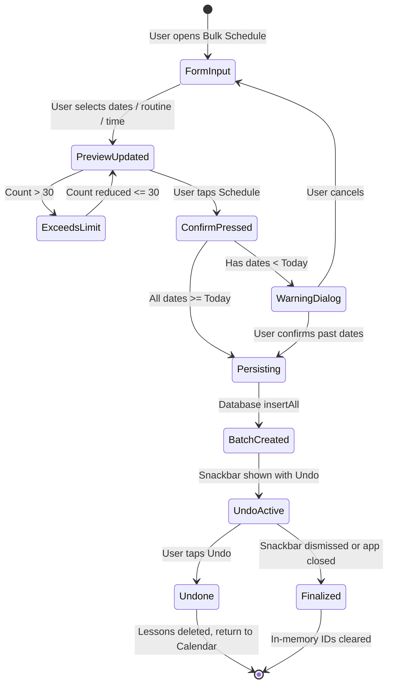

# Data Model: Bulk Lesson Scheduling

**Feature**: `008-bulk-lesson-scheduling`  
**Date**: 2026-09-06  
**Status**: Completed  

## 1. Domain Models (`domain/model/`)

All domain models reside in `com.barutdev.tullab.domain.model` and have zero Android dependencies.

### `BulkScheduleMode`
Enum specifying the active planning method.
```kotlin
enum class BulkScheduleMode {
    CALENDAR_GRID,
    WEEKLY_ROUTINE
}
```

### `WeeklyRoutineEndCondition`
Sealed interface representing the termination rule for Weekly Routine mode.
```kotlin
sealed interface WeeklyRoutineEndCondition {
    data class ByEndDate(val endDate: LocalDate) : WeeklyRoutineEndCondition
    data class ByTargetCount(val targetCount: Int) : WeeklyRoutineEndCondition
}
```

### `BulkLessonCandidate`
A calculated candidate lesson slot before database persistence.
```kotlin
data class BulkLessonCandidate(
    val date: LocalDate,
    val time: LocalTime,
    val epochMillis: Long,
    val isConflict: Boolean = false,
    val isPast: Boolean = false
)
```

### `BulkScheduleDraft`
The complete configuration state representing the tutor's current bulk scheduling form.
```kotlin
data class BulkScheduleDraft(
    val studentId: Int,
    val mode: BulkScheduleMode = BulkScheduleMode.CALENDAR_GRID,
    val selectedDates: Set<LocalDate> = emptySet(),
    val selectedDaysOfWeek: Set<DayOfWeek> = emptySet(),
    val routineStartDate: LocalDate = LocalDate.now(),
    val endCondition: WeeklyRoutineEndCondition = WeeklyRoutineEndCondition.ByTargetCount(4),
    val defaultStartTime: LocalTime = LocalTime.of(15, 0),
    val customDayTimes: Map<LocalDate, LocalTime> = emptyMap(),
    val useCustomRate: Boolean = false,
    val customRate: Double? = null
) {
    val effectiveRate: (studentDefaultRate: Double) -> Double = { studentDefaultRate ->
        if (useCustomRate && customRate != null && customRate >= 0.0) customRate else studentDefaultRate
    }
}
```

### `BulkScheduleResult`
Outcome returned by the domain use case upon persistence.
```kotlin
data class BulkScheduleResult(
    val studentId: Int,
    val createdLessons: List<Lesson>,
    val skippedCount: Int,
    val hasPastLessons: Boolean
) {
    val createdCount: Int get() = createdLessons.size
    val createdLessonIds: List<Int> get() = createdLessons.map { it.id }
}
```

### `BatchUndoSession` (In-Memory Session Model)
Transient in-memory token held while the completion notification (Snackbar) is active.
```kotlin
data class BatchUndoSession(
    val studentId: Int,
    val lessonIds: List<Int>,
    val createdAtEpochMillis: Long = System.currentTimeMillis()
)
```

---

## 2. Storage & Schema Impact

### Room Database (`lessons` Table)
No changes required to the Room schema or `LessonEntity`.
- Lessons are inserted with:
  - `studentId`: Selected student ID
  - `date`: `candidate.epochMillis`
  - `status`: `LessonStatus.SCHEDULED`
  - `durationInHours`: `null` (duration is only set when completed)
  - `pricingMode`: `PricingMode.PER_HOUR`
  - `rateOrFee`: Effective hourly rate
  - `paymentTimestamp`: `null`
  - `notes`: `null`
- Room version remains `10` (no migrations).

---

## 3. Validation Rules

| Rule ID | Constraint | Violation Result |
|---|---|---|
| **VR-001** | Total candidates $\le 30$ | Confirmation disabled; inline red message: "You can schedule a maximum of 30 lessons at once." |
| **VR-002** | Total valid (non-conflicting) candidates $> 0$ | Confirmation disabled; helper message indicating no dates selected or all dates conflict. |
| **VR-003** | Custom hourly rate $> 0.0$ when custom rate toggle is enabled | Confirmation disabled; rate input field shows validation error. |
| **VR-004** | At least one weekday selected in Weekly Routine mode | Candidate list empty; prompts tutor to select recurring days. |
| **VR-005** | Routine End Date $\ge$ Routine Start Date | Candidate list empty; end date picker rejects earlier dates. |
| **VR-006** | Target lesson count between $1$ and $30$ | Truncated or flagged with VR-001. |

---

## 4. Lifecycle & State Machine


