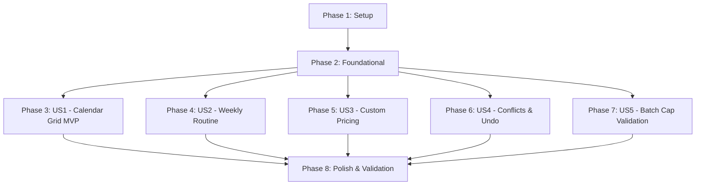

# Tasks: Bulk Lesson Scheduling

**Feature**: `008-bulk-lesson-scheduling`  
**Input**: Feature specification from `specs/008-bulk-lesson-scheduling/spec.md`  
**Design Artifacts**: `plan.md`, `research.md`, `data-model.md`, `contracts/`, `quickstart.md`  

---

## Phase 1: Setup (Shared Infrastructure)

**Purpose**: Establish base strings, plural resources, and domain value models required across all user stories.

- [x] T001 [P] Add English strings and plural resources for bulk scheduling in `app/src/main/res/values/strings.xml`
- [x] T002 [P] Add Turkish translations and plural resources for bulk scheduling in `app/src/main/res/values-tr/strings.xml`
- [x] T003 [P] Add German translations and plural resources for bulk scheduling in `app/src/main/res/values-de/strings.xml`
- [x] T004 [P] Create bulk schedule domain models (`BulkScheduleMode`, `WeeklyRoutineEndCondition`, `BulkLessonCandidate`, `BulkScheduleDraft`, `BulkScheduleResult`, `BatchUndoSession`) in `app/src/main/java/com/barutdev/tullab/domain/model/BulkScheduleModels.kt`

---

## Phase 2: Foundational (Blocking Prerequisites)

**Purpose**: Core data layer methods, repository interfaces, navigation routes, and domain use cases that MUST be complete before UI screen implementation.

**⚠️ CRITICAL**: All user story tasks depend on this foundational phase.

- [x] T005 [P] Add batch database operations (`insertLessons`, `deleteLessons`, `getLessonDatesForStudent`) in `app/src/main/java/com/barutdev/tullab/data/local/LessonDao.kt`
- [x] T006 [P] Add batch methods to `LessonRepository` interface in `app/src/main/java/com/barutdev/tullab/domain/repository/LessonRepository.kt`
- [x] T007 [P] Implement batch repository methods in `app/src/main/java/com/barutdev/tullab/data/repository/LessonRepositoryImpl.kt` (depends on T005, T006)
- [x] T008 [P] Register `BulkSchedule` student-scoped destination in `app/src/main/java/com/barutdev/tullab/navigation/TullabDestinations.kt`
- [x] T009 [P] Create `CalculateBulkLessonCandidatesUseCase` in `app/src/main/java/com/barutdev/tullab/domain/usecase/lesson/CalculateBulkLessonCandidatesUseCase.kt`
- [x] T010 [P] Create `CreateBulkLessonsUseCase` in `app/src/main/java/com/barutdev/tullab/domain/usecase/lesson/CreateBulkLessonsUseCase.kt`
- [x] T011 [P] Create `UndoBulkLessonsUseCase` in `app/src/main/java/com/barutdev/tullab/domain/usecase/lesson/UndoBulkLessonsUseCase.kt`
- [x] T012 [P] Create unit test suite `CalculateBulkLessonCandidatesUseCaseTest` in `app/src/test/java/com/barutdev/tullab/domain/usecase/lesson/CalculateBulkLessonCandidatesUseCaseTest.kt`
- [x] T013 [P] Create unit test suite `CreateBulkLessonsUseCaseTest` in `app/src/test/java/com/barutdev/tullab/domain/usecase/lesson/CreateBulkLessonsUseCaseTest.kt`
- [x] T014 [P] Create unit test suite `UndoBulkLessonsUseCaseTest` in `app/src/test/java/com/barutdev/tullab/domain/usecase/lesson/UndoBulkLessonsUseCaseTest.kt`

**Checkpoint**: Foundation ready — domain use cases, repositories, and destinations verified by unit tests.

---

## Phase 3: User Story 1 - Bulk Scheduling via Calendar Date Selection (Priority: P1) 🎯 MVP

**Goal**: Enable tutors to freely select specific dates from a monthly calendar grid for a student, assign a default start time, customize individual day times via chips, and save the batch.

**Independent Test**: Open Student Calendar for John Doe, tap "Bulk Add Lessons", pick 3 dates across the monthly grid, customize time for 1 date via chip, confirm creation, and verify 3 scheduled lessons appear on those dates with the customized times.

### Implementation for User Story 1

- [x] T015 [P] [US1] Create `CalendarGridSelector` composable with multi-date toggle and month navigation in `app/src/main/java/com/barutdev/tullab/ui/screens/bulk_schedule/components/CalendarGridSelector.kt`
- [x] T016 [P] [US1] Create `DayTimeChipList` composable displaying selected day chips with time picker triggers in `app/src/main/java/com/barutdev/tullab/ui/screens/bulk_schedule/components/DayTimeChipList.kt`
- [x] T017 [P] [US1] Create `PastDateWarningDialog` composable alerting tutors when dates prior to today are selected in `app/src/main/java/com/barutdev/tullab/ui/screens/bulk_schedule/components/PastDateWarningDialog.kt`
- [x] T018 [US1] Create `BulkScheduleUiState` and `BulkScheduleViewModel` managing draft state and date selection in `app/src/main/java/com/barutdev/tullab/ui/screens/bulk_schedule/BulkScheduleViewModel.kt`
- [x] T019 [US1] Create `BulkScheduleScreen` assembling TopBar, tab header, calendar grid, chip list, and confirm button in `app/src/main/java/com/barutdev/tullab/ui/screens/bulk_schedule/BulkScheduleScreen.kt` (depends on T015, T016, T017, T018)
- [x] T020 [US1] Register `BulkScheduleScreen` route in `app/src/main/java/com/barutdev/tullab/navigation/TullabNavGraph.kt` (depends on T008, T019)
- [x] T021 [US1] Add "Bulk Add Lessons" action icon to TopBar in `app/src/main/java/com/barutdev/tullab/ui/screens/calendar/CalendarScreen.kt` navigating to `BulkSchedule`
- [x] T022 [US1] Create unit tests for `BulkScheduleViewModel` covering date selection, default time assignment, and chip customizations in `app/src/test/java/com/barutdev/tullab/ui/screens/bulk_schedule/BulkScheduleViewModelTest.kt`

**Checkpoint**: User Story 1 complete — tutors can select multiple calendar dates, customize day times, and create lessons in bulk (MVP viable).

---

## Phase 4: User Story 2 - Bulk Scheduling via Weekly Routine (Priority: P1)

**Goal**: Allow tutors to define recurring weekly routines by selecting weekdays, setting a configurable start date, and specifying either an end date or a target number of lessons.

**Independent Test**: Open Bulk Add Lessons, switch to "Weekly Routine" mode, pick Tuesdays and Thursdays, set Start Date to next week, choose target count = 6, and verify 6 successive Tuesday/Thursday lessons are generated.

### Implementation for User Story 2

- [x] T023 [P] [US2] Add unit test scenarios for weekly recurrence generation (by end date and by target count) in `app/src/test/java/com/barutdev/tullab/domain/usecase/lesson/CalculateBulkLessonCandidatesUseCaseTest.kt`
- [x] T024 [US2] Implement weekly routine candidate recurrence algorithm in `app/src/main/java/com/barutdev/tullab/domain/usecase/lesson/CalculateBulkLessonCandidatesUseCase.kt`
- [x] T025 [P] [US2] Create `WeeklyRoutineSelector` composable with weekday toggles, start date picker, and end condition radio options in `app/src/main/java/com/barutdev/tullab/ui/screens/bulk_schedule/components/WeeklyRoutineSelector.kt`
- [x] T026 [US2] Integrate `WeeklyRoutineSelector` into `BulkScheduleScreen.kt` and wire state transitions in `app/src/main/java/com/barutdev/tullab/ui/screens/bulk_schedule/BulkScheduleViewModel.kt`
- [x] T027 [US2] Add unit tests for Weekly Routine interactions and recurrence recalculation in `app/src/test/java/com/barutdev/tullab/ui/screens/bulk_schedule/BulkScheduleViewModelTest.kt`

**Checkpoint**: User Story 2 complete — recurring weekly routines can be generated by end date or lesson count.

---

## Phase 5: User Story 3 - Custom Batch Pricing Override (Priority: P2)

**Goal**: Prefill the batch hourly rate with the student's profile rate, provide an optional checkbox to reveal a custom rate input, and apply the custom rate to all created lessons in the batch.

**Independent Test**: Open Bulk Add Lessons for a student with a $50/hr rate, check the custom rate toggle, enter $40/hr, confirm creation, and verify each resulting lesson is recorded with a $40/hr pricing snapshot while leaving the student's profile rate at $50/hr.

### Implementation for User Story 3

- [x] T028 [P] [US3] Add unit tests verifying custom rate snapshot application versus student profile rate fallback in `app/src/test/java/com/barutdev/tullab/domain/usecase/lesson/CreateBulkLessonsUseCaseTest.kt`
- [x] T029 [P] [US3] Create `BulkSchedulePricingSection` composable with default rate display, optional checkbox toggle, and custom rate text field in `app/src/main/java/com/barutdev/tullab/ui/screens/bulk_schedule/components/BulkSchedulePricingSection.kt`
- [x] T030 [US3] Connect custom rate state handling and input validation in `app/src/main/java/com/barutdev/tullab/ui/screens/bulk_schedule/BulkScheduleViewModel.kt`
- [x] T031 [US3] Integrate `BulkSchedulePricingSection` into `app/src/main/java/com/barutdev/tullab/ui/screens/bulk_schedule/BulkScheduleScreen.kt`
- [x] T032 [US3] Add unit tests for pricing toggle and custom rate validation in `app/src/test/java/com/barutdev/tullab/ui/screens/bulk_schedule/BulkScheduleViewModelTest.kt`

**Checkpoint**: User Story 3 complete — tutors can schedule batches at special promotional or discounted hourly rates without altering profile defaults.

---

## Phase 6: User Story 4 - Conflict Detection, Feedback, and Single-Tap Undo (Priority: P2)

**Goal**: Automatically detect and skip lessons that collide on exact student date and start time, display created versus skipped counts in a completion Snackbar, and provide an instant single-tap Undo rollback.

**Independent Test**: Create a lesson for Student A on Friday at 15:00. Bulk schedule a batch for Student A including Friday at 15:00 and Saturday at 15:00. Verify only Saturday is created, the Snackbar reports 1 created and 1 skipped, and tapping "Undo" deletes the Saturday lesson cleanly.

### Implementation for User Story 4

- [x] T033 [P] [US4] Add unit tests in `CalculateBulkLessonCandidatesUseCaseTest.kt` verifying exact student date-time conflict detection and fixed-window skipping
- [x] T034 [P] [US4] Add unit tests in `UndoBulkLessonsUseCaseTest.kt` verifying batch deletion by ID list
- [x] T035 [US4] Add in-memory `BatchUndoSession` state holder and `undoBulkLessons` method in `app/src/main/java/com/barutdev/tullab/ui/screens/calendar/CalendarViewModel.kt`
- [x] T036 [US4] Update `CalendarScreen.kt` to observe batch completion results and display a Snackbar with created/skipped plurals and an "Undo" action in `app/src/main/java/com/barutdev/tullab/ui/screens/calendar/CalendarScreen.kt`
- [x] T037 [US4] Create unit test in `app/src/test/java/com/barutdev/tullab/ui/screens/calendar/CalendarViewModelTest.kt` verifying the Undo flow and state clearing upon dismiss

**Checkpoint**: User Story 4 complete — automatic conflict skipping and single-tap Undo rollback verified end-to-end.

---

## Phase 7: User Story 5 - Batch Cap Enforcement and Validation (Priority: P3)

**Goal**: Enforce a strict 30-lesson batch cap with an immediate red inline validation message and disabled confirmation button when exceeded.

**Independent Test**: Select 31 dates in the calendar grid or a routine targeting 35 lessons. Verify a red warning appears stating "You can schedule a maximum of 30 lessons at once." and the confirmation button is disabled.

### Implementation for User Story 5

- [x] T038 [P] [US5] Add unit test scenarios verifying candidate limit boundary conditions ($=30$ allowed, $>30$ rejected) in `CalculateBulkLessonCandidatesUseCaseTest.kt`
- [x] T039 [US5] Create `BulkSchedulePreviewBar` composable with dynamic counts, total rate, red validation text when $>30$, and confirm button in `app/src/main/java/com/barutdev/tullab/ui/screens/bulk_schedule/components/BulkSchedulePreviewBar.kt`
- [x] T040 [US5] Wire cap validation state (`isExceedingLimit`, `canConfirm`) in `app/src/main/java/com/barutdev/tullab/ui/screens/bulk_schedule/BulkScheduleViewModel.kt`
- [x] T041 [US5] Integrate `BulkSchedulePreviewBar` into `app/src/main/java/com/barutdev/tullab/ui/screens/bulk_schedule/BulkScheduleScreen.kt`
- [x] T042 [US5] Add unit test in `BulkScheduleViewModelTest.kt` asserting `canConfirm == false` when candidate count exceeds 30

**Checkpoint**: User Story 5 complete — 30-lesson limit strictly enforced with clear visual feedback.

---

## Phase 8: Polish & Cross-Cutting Concerns

### Phase 8: Polish & Cross-Cutting Concerns
- `[x]` T043 [P] Verify string and plural parity across English, Turkish, and German in `app/src/main/res/`
- `[x]` T044 Verify touch target sizes ($\ge 48\times 48$ dp) on all calendar day cells, routine weekday toggles, and chip buttons in `BulkScheduleScreen`
- `[x]` T045 Execute all unit tests via `./gradlew testDebugUnitTest` and ensure zero failures
- `[x]` T046 Run assemble check via `./gradlew assembleDebug` to verify compilation and ProGuard hygiene
- `[x]` T047 Execute manual validation walkthrough according to `specs/008-bulk-lesson-scheduling/quickstart.md`

---

## Dependencies & Execution Order

### Phase Dependencies

### User Story Dependencies

- **US1 (Calendar Grid - P1)**: Core MVP. Requires Phase 1 & 2. Independent of other stories.
- **US2 (Weekly Routine - P1)**: Requires Phase 1 & 2. Plugs into the mode tab of `BulkScheduleScreen`.
- **US3 (Custom Pricing - P2)**: Requires Phase 1 & 2. Adds pricing section to `BulkScheduleScreen`.
- **US4 (Conflicts & Undo - P2)**: Requires Phase 1 & 2. Coordinates between `BulkScheduleScreen` and `CalendarScreen`.
- **US5 (Batch Cap - P3)**: Requires Phase 1 & 2. Enforces cap on `BulkSchedulePreviewBar`.

### Parallel Opportunities

- **Phase 1**: T001, T002, T003, T004 can all execute in parallel.
- **Phase 2**: T005, T006, T008, T009, T010, T011, T012, T013, T014 can run in parallel.
- **Phase 3+**: Once Phase 2 is complete, US1, US2, US3, US4, and US5 components can be implemented incrementally and tested independently.

---

## Implementation Strategy

### MVP First (User Story 1 Only)
1. Complete Phase 1 (Setup) and Phase 2 (Foundational).
2. Complete Phase 3 (User Story 1: Calendar Grid Mode).
3. Validate User Story 1 using unit tests and manual verification.
4. Tutors can now schedule lessons in bulk via calendar date selection!

### Incremental Feature Delivery
1. Add User Story 2 (Weekly Routine) $\to$ unlock recurring term schedules.
2. Add User Story 3 (Custom Pricing) $\to$ unlock promotional and package rates.
3. Add User Story 4 (Conflict Skipping & Undo) $\to$ unlock collision protection and instant error recovery.
4. Add User Story 5 (Batch Cap) $\to$ unlock safety limits and guardrails.
5. Complete Phase 8 (Polish) $\to$ verify i18n, a11y, and build health.
