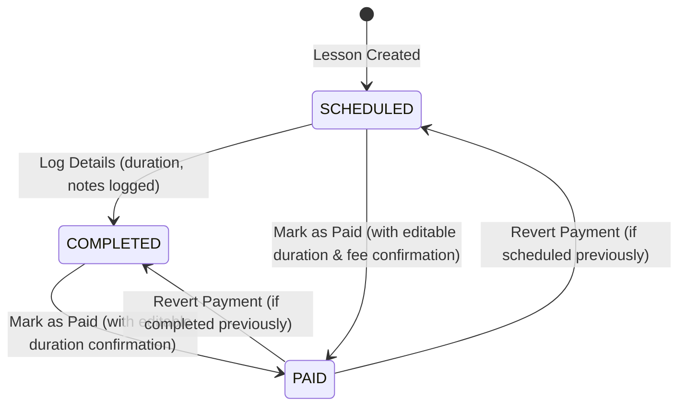

# Data Model: Refined Improvements & Bug Fixes

## 1. CurrencyOption (Domain / UI Model)

Represents an active ISO 4217 currency selectable by the user in Settings.

```kotlin
package com.barutdev.tullab.domain.model

data class CurrencyOption(
    val code: String,          // ISO 4217 3-letter code (e.g. "USD", "EUR", "TRY", "GBP")
    val displayName: String,   // Localized or canonical name (e.g. "Turkish Lira (TRY)")
    val symbol: String         // Currency symbol (e.g. "₺", "$", "€", "£")
)
```

### Validation & Sorting Rules
- `code` must be a non-empty, 3-character uppercase ISO 4217 code.
- Currency list is sorted alphabetically by `code` or `displayName`.
- Filter query matches case-insensitively against `code` and `displayName`.

---

## 2. UserPreferences (Data Store Model)

Existing model in `com.barutdev.tullab.domain.model.UserPreferences`.
- `currencyCode: String`: Persists the selected ISO 4217 code (default: `"USD"` or locale-inferred via `SmartLocaleDefaults`).
- Validated to accept any standard ISO 4217 currency code.

---

## 3. Lesson (Room Entity & Domain Model)

Existing model in `com.barutdev.tullab.domain.model.Lesson`.
- When marked as paid via `LogLessonDialog` or `paymentRepository.markLessonAsPaid(lessonId, duration, customFee)`:
  - `durationInHours: Double?`: Updated with user-edited positive duration value.
  - `calculatedValue: Double`: Dynamically recalculated based on new duration and rate (or updated custom fee).
  - `status`: Transitioned to `LessonStatus.PAID`.
  - `paymentTimestamp`: Set to current system time.

---

## 4. State Transitions


