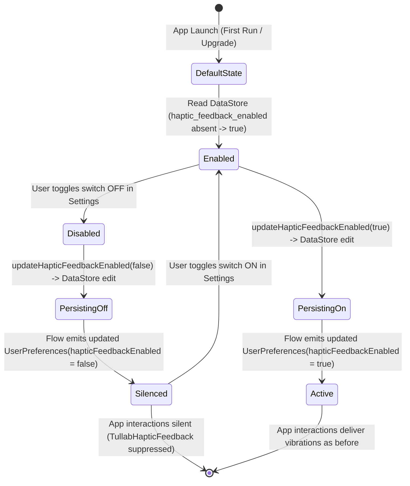

# Data Model: Haptic Feedback Toggle

## Overview

The haptic feedback toggle introduces a user preference to control tactile sensations across the Tullab application. It extends the existing `UserPreferences` entity and DataStore schema without introducing new database tables or Room migrations.

---

## Entities

### `UserPreferences` (Domain Model)

**Package**: `com.barutdev.tullab.domain.model.UserPreferences`

| Field | Type | Default | Description |
|---|---|---|---|
| `isDarkMode` | `Boolean` | `false` | Whether dark theme is enabled |
| `languageCode` | `String` | Device default / `"en"` | BCP-47 language tag |
| `currencyCode` | `String` | Device default / `"USD"` | ISO 4217 currency code |
| `defaultHourlyRate` | `Double` | `0.0` | Default rate for new students |
| `lessonRemindersEnabled` | `Boolean` | `false` | Notification alarm for upcoming lessons |
| `logReminderEnabled` | `Boolean` | `false` | Daily reminder to log lessons |
| `lessonReminderHour` | `Int` | `9` | Hour of lesson reminder alarm (0-23) |
| `lessonReminderMinute` | `Int` | `0` | Minute of lesson reminder alarm (0-59) |
| `logReminderHour` | `Int` | `20` | Hour of log reminder alarm (0-23) |
| `logReminderMinute` | `Int` | `0` | Minute of log reminder alarm (0-59) |
| **`hapticFeedbackEnabled`** | **`Boolean`** | **`true`** | **Whether app-initiated tactile feedback & vibrations are enabled** *(NEW)* |

#### Constraints & Validation Rules
- `hapticFeedbackEnabled` is non-null.
- When uninitialized or absent in persistent storage, it MUST evaluate to `true`.
- Default value in constructor `hapticFeedbackEnabled: Boolean = true` guarantees backward compatibility with existing call sites and test instantiations.

---

## DataStore Schema Extension

**File**: `com.barutdev.tullab.data.repository.UserPreferencesRepository.kt`

### Preferences Keys

```kotlin
val HAPTIC_FEEDBACK_ENABLED_KEY = booleanPreferencesKey("haptic_feedback_enabled")
```

### Persistence Mapping

- **Read**:
  ```kotlin
  hapticFeedbackEnabled = preferences[HAPTIC_FEEDBACK_ENABLED_KEY] ?: true
  ```
- **Write**:
  ```kotlin
  dataStore.edit { preferences ->
      preferences[HAPTIC_FEEDBACK_ENABLED_KEY] = isEnabled
  }
  ```
- **Reset**:
  ```kotlin
  // In resetPreferences():
  preferences[HAPTIC_FEEDBACK_ENABLED_KEY] = true
  ```

---

## State Lifecycle & Transitions


